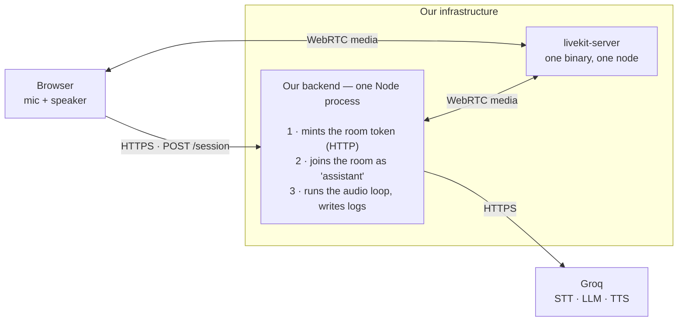
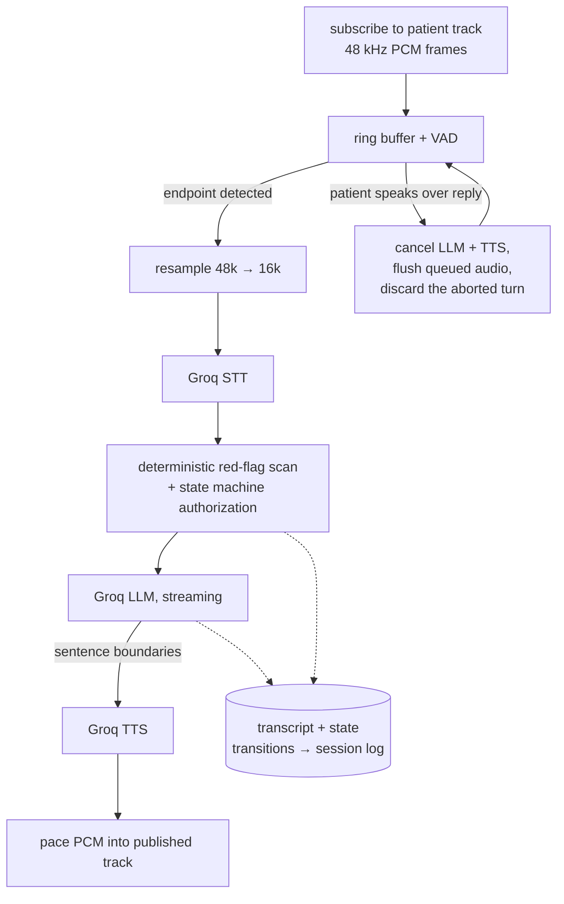

# Self-hosted voice architecture — LiveKit + Groq

- **Status:** Proposal — not implemented, not yet decided
- **Date:** 2026-08-21
- **Author:** Adam Mrotek
- **Supersedes if adopted:** the OpenAI Realtime transport described in `README.md`; leaves [ADR 0001](adr/0001-backend-owned-state-machine.md) intact and, as argued below, strengthens it

> **Where this landed.** This note was written before the code existed and uses
> the names the prototype had — `backend/`, one process, one folder. Phase 1 is
> built, and it lives under `services/`: the audio loop, safety gate and state
> machine in `services/agent`, the WebRTC transport in `services/media`, the
> HTTP surface in `services/core`. The proposal's `scan.ts` is
> `services/agent/src/safety/scan.ts`. See [`system-map.md`](./system-map.md)
> for the shape it grew into, and
> [`../services/agent/docs/inference-corrections.md`](../services/agent/docs/inference-corrections.md)
> for where the inference table below is stale.

## Why change anything

The prototype works. The browser opens a WebRTC connection straight to OpenAI's Realtime API, the backend mints an ephemeral key and then sits to the side receiving tool calls over the data channel. It is the lowest-latency thing you can build and it took very little code.

It has two properties that become problems the moment this stops being a prototype:

**Patient audio goes to a US processor over a connection we do not own.** Not just the transcript — the raw voice of a person describing their symptoms, transiting to an endpoint outside our control, on a session we can observe but cannot inspect. For synthetic data that is fine. For an NHS deployment it is the first question anyone will ask, and "we mint an ephemeral key" is not an answer to it.

**The backend is downstream of the conversation it is supposed to govern.** ADR 0001 established that the backend owns conversation state, and it does — but it owns it by *reacting*. The model decides to call `update_intake`, the browser relays that call, and only then does our authorization check run. The server is authoritative over the record, but it is not in the path of the audio. The deterministic red-flag scanner in `backend/src/safety/scan.ts` runs on transcripts the model chose to send us.

This proposal moves the backend into the media path. That is the actual architectural change; self-hosting is what it enables.

## Target topology

Two processes. One of them is the backend we already have.

The backend is a **participant in the call**, not a service standing beside it. It is the same Express process that mints the OpenAI ephemeral key today; what's added is a persistent WebRTC connection into each room, held open for the length of the conversation.

Everything inside the boundary is ours to host, patch, log, and put in a DPIA. The only egress is the three inference calls, and those sit behind an interface designed to be swapped — see [Where this leaves NHS](#where-this-leaves-nhs).

## What "self-hosted LiveKit" actually involves

Less than it sounds like:

| Component | Needed? | Notes |
|---|---|---|
| `livekit-server` | **yes** | one Go binary, one YAML file, no external dependencies at a single node |
| TURN relay | **yes** — but it's built in | enable it in `livekit.yaml`; a separate coturn is only for scale or split deployment |
| UDP 50000–60000 | yes | the port range firewall reviews object to |
| Redis | **no** | LiveKit uses it to share room state across *multiple* SFU nodes. One node, no Redis. Revisit at [More than one box](#more-than-one-box) |

**TURN over TLS:443 is the part to take seriously.** Hospital and GP networks are the hostile case: outbound UDP frequently blocked, forced HTTPS proxies, deep packet inspection. A voice assistant that works on home broadband and fails in a clinic is worthless. Plan for TURN-over-TCP-443 as the assumed path rather than the fallback, and test against a real trust network before committing to the design.

Roughly 10–15% of general internet users need TURN at all; on locked-down clinical networks, assume most of them will.

## Session lifecycle

One HTTP call starts everything. `POST /session` does four things in order, and the order is the point:

1. Create the session record and a room name (reusing the existing `intakeStore` session identity).
2. Join that room from this process, as participant `assistant`, and **wait for the connection to be established**.
3. Mint a LiveKit access token scoped to that room and that patient identity.
4. Return the token to the browser.

The browser connects with the token and finds the assistant already there. Because we join before we hand out the token, there is no race and no window in which a patient sits in an empty room — a guarantee we get for free from doing both jobs in one process, and one we'd have to engineer back if we split them.

Teardown is the mirror: the room closes, we disconnect, and the session record is finalized through the existing state machine.

## The backend as a participant

The LiveKit Agents framework exists to bind a worker process to a room and run the conversation loop inside it. We are not using it (see [Why not the Agents SDK](#why-not-the-agents-sdk)), so the loop is ours.

Joining a room from Node uses the **LiveKit realtime client SDK** — `@livekit/rtc-node` — which is a binding over the same Rust core the browser SDK uses, and a supported way to put a server-side participant in a room. (`livekit`'s `rtc` module is the Python equivalent if we'd rather run the audio loop there.) Neither is the Agents framework, and neither pulls it in.

The loop, per turn:

Step **e** is the point of the whole exercise. The transcript passes through our code before it reaches the model, and the model's reply passes through our code before it reaches the patient. `scan.ts` becomes an inline gate rather than a parallel observer, and `isToolAllowed()` guards a tool call that physically cannot bypass us. ADR 0001's principle is unchanged; its enforcement stops depending on the model's cooperation.

**Logging comes free from the same position.** Because every transcript and every reply passes through this process, the session log is written from the source rather than reconstructed from what the browser relayed — both sides of the conversation, every state transition, and every red-flag hit, appended to the existing `record.history` audit trail. Whether raw audio is retained alongside the transcript is a retention decision, not a technical one, and should be settled in the DPIA before phase 2.

### What we build that the framework would have given us

This is the honest cost of the decision, in rough order of difficulty:

1. **Endpointing.** "Is this silence a pause or a finished turn?" A fixed 500 ms threshold handles *"how are you today"* and becomes infuriating for a patient describing symptoms haltingly, or elderly, or in pain. This is the single hardest quality problem in the system and the one most likely to make the assistant feel bad to use.
2. **Barge-in.** The patient interrupts: cancel the in-flight LLM and TTS, drop queued frames, and make sure the abandoned reply never lands in conversation history. Getting this wrong corrupts the record, not just the experience.
3. **VAD.** Silero ONNX, running locally in-process — roughly 1 ms per frame on CPU. Not a Groq call.
4. **Call lifecycle.** A defined behaviour when the backend restarts mid-call. A patient alone in a room with a silent assistant is a clinical failure mode, not an uptime statistic.
5. **Backpressure.** TTS generates faster than realtime; frames have to be paced into the published track rather than dumped.
6. **Resampling.** WebRTC delivers 48 kHz, Whisper wants 16 kHz.

Items 1 and 2 are where the engineering time actually goes. The rest is plumbing.

### Sizing

A conversation is I/O-bound — mostly waiting on network, with VAD as the only steady CPU cost. One 4-core instance should hold roughly 30–50 concurrent conversations before the audio loop becomes the constraint. For a prototype and a pilot, one box is the whole deployment.

The thing to internalise is that **this process is now stateful**. Today's backend can be restarted at any time; a backend holding live WebRTC connections cannot, because restarting it drops every call in progress. Deploys have to drain — stop accepting new sessions, wait for active ones to finish — which is a change in how the service is operated, not just how it is built.

## The inference pipeline

| Stage | Model | Role |
|---|---|---|
| STT | `whisper-large-v3-turbo` | utterance PCM → transcript |
| LLM | `llama-3.3-70b-versatile` | history + system prompt → reply, streamed |
| TTS | `playai-tts` | reply text → PCM, streamed |

**Latency, roughly.** Estimate only — measure before quoting it to anyone:

| | |
|---|---|
| endpoint detection | ~300–500 ms (a design choice, not a cost) |
| STT | ~150 ms |
| LLM first token | ~200 ms |
| TTS first audio | ~150 ms |
| network + jitter buffer | ~100 ms |
| **perceived first sound** | **~700–900 ms** |

That budget only holds if the stages overlap. Cut the LLM stream at sentence boundaries and start TTS on sentence one rather than awaiting the full reply — that single decision is most of the difference between this feeling responsive and feeling like a phone tree.

It will be slower than the current Realtime API setup, which is a single speech-to-speech model with no pipeline seams. That is a real regression and should be stated plainly rather than discovered in a demo.

## Where this leaves NHS

Self-hosting the transport puts the audio path under our control and answers most of the infrastructure questions. It does not answer the inference question. **Groq is US-hosted.** For identifiable patient data that raises UK GDPR international transfer obligations on top of DSPT and DTAC evidence, and "our SFU is in-region" is not responsive to it.

Two things follow.

**Do not build against Groq's SDK.** Define three internal interfaces in the worker and put every provider behind them:

- `transcribe(pcm) → text`
- `complete(messages) → AsyncIterable<string>`
- `speak(text) → AsyncIterable<PCM>`

Then the provider is configuration, and the swap below is a deployment change rather than a rewrite. This costs a few hours now and is the difference between a procurement conversation and a re-platforming.

**Know what the fully in-house version costs.**

| Stage | Groq today | Self-hosted equivalent | Cost of the swap |
|---|---|---|---|
| STT | whisper-large-v3-turbo | `faster-whisper` on an L4/T4 | modest — quality holds |
| LLM | llama-3.3-70b | vLLM + Llama 3.3 70B (2×A100 or 4×L40S) | the expensive one, in GPU and in ops |
| TTS | playai-tts | Kokoro, or Piper on CPU | voice quality drops noticeably |

Groq's inference speed is genuinely hard to match on our own hardware, so the latency budget above gets worse again. But the architecture does not change — same worker, same loop, same interfaces — and the boundary in the topology diagram closes completely.

## Why not the Agents SDK

The framework would supply items 1–6 above, working, today, with a Groq plugin already written. Declining it costs real weeks.

The reason to decline it is that endpointing and barge-in are not incidental infrastructure for this product — they are clinical behaviour. When a patient trails off mid-sentence describing a headache, what the system does next is a decision we need to own, tune, and be able to explain to a clinical safety officer under DCB0129. Framework defaults are tuned for consumer voice agents, and overriding them from outside is generally harder than owning the loop.

That reasoning is worth revisiting if the timeline compresses. Building on the framework first and replacing the loop later is a legitimate path — the transport, the session lifecycle, and the provider interfaces are all unchanged by that choice; only the internals of the loop differ.

## More than one box

Not now. Recorded here only so the phase-1 design isn't mistaken for a dead end, and so the Redis question has an answer when it comes back.

Two limits arrive at different times, and they are independent:

**Audio capacity** goes first, somewhere past a few dozen concurrent conversations. The fix is to split the one process into two roles — an HTTP service that mints tokens and owns session records, and a pool of audio processes that join rooms. That reintroduces *dispatch*: something has to decide which process joins which room, either pushed by the HTTP service at `/session` time or pulled by workers off LiveKit's `participant_joined` webhook. Push is the better default, because we want to choose placement and know which process is holding which patient.

**SFU capacity** goes much later — a single `livekit-server` node handles far more traffic than our audio loop will. When a second SFU node is added, the nodes need shared room state, and *that* is the moment Redis enters the design. Not before.

Both of those are ordinary scaling work. Neither changes the loop, the interfaces, or the trust boundary, which is why phase 1 does not need to anticipate them.

## What we give up

- **Latency**, as above — a pipeline cannot match a native speech-to-speech model.
- **Prosody.** The Realtime API hears tone, hesitation, and distress; a Whisper transcript is flat text. For a triage assistant this may matter clinically and deserves a proper look before committing.
- **Weeks of work**, replacing a component that currently functions.

What we get is an audio path we own, a server that is in the conversation rather than beside it, and a deployment story that can survive an information governance review.

## Open questions

1. Does losing vocal prosody degrade triage quality enough to matter? Testable against the existing prototype before any of this is built.
2. Does Groq offer a UK/EU processing region or contractual terms that make phase 1 viable with real data, or is the self-hosted inference tier a hard prerequisite for anything beyond synthetic?
3. What is the failure behaviour when the backend restarts mid-call — resume with replayed history, or end the session and require the patient to start again? This is a clinical safety decision, not a technical one.
4. Which trust network do we test TURN against, and when?
5. Is raw audio retained at all, or only transcripts and state transitions? Affects the DPIA more than the code.

## Suggested phasing

**Phase 1 — prove the loop.** One `livekit-server`, one backend process doing both jobs, Groq behind the three interfaces, synthetic data only, state machine and red-flag scan moved inline. Goal: a conversation that feels acceptable, and a measured latency number to compare against the current prototype.

**Phase 2 — make it survivable.** Drain-on-deploy, defined mid-call failure behaviour, TURN validated on a real clinical network, session logging aligned with the ISO 27001 gap assessment. Split into a worker pool only if capacity actually demands it.

**Phase 3 — close the boundary.** Self-hosted inference tier, if and when identifiable data is in scope.
